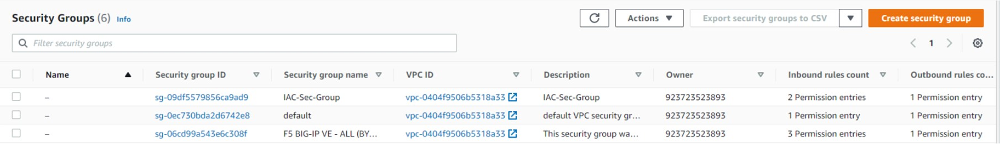

# CREATION DES SECURITY GROUPS

Sur AWS, un [security group](https://docs.aws.amazon.com/vpc/latest/userguide/vpc-security-groups.html) permet de spécifier les flux autorisés à atteindre une ressource et/ou à sortir d’une ressource. Un unique security-group peut être attaché à plusieurs ressources. 

L’infrastructure que vous devez créer nécessite 3 security groups :

- 1 x security group pour le load-balancer
    - Permet aux utilisateurs d’accéder à l’application web depuis leur navigateur
    - Autorise les flux HTTP depuis n’importe quelle source
    - Autorise tous les flux vers n’importe quelle destination

- 1 x security group pour le serveur web
    - Permet au serveur web de recevoir les requêtes des utilisateurs transmises par le LB
    - Permet de vous connecter au serveur web au travers du protocole SSH
    - Autorise les flux HTTP depuis le security group du load-balancer
    - Autorise les flux SSH depuis votre adresse IP
    - Autorise tous les flux vers n’importe quelle destination

- 1 x security group pour la base de données MySQL
    - Permet à la base de données de recevoir les requêtes SQL envoyées par le serveur web
    - Autorise les flux MySQL (port 3306) depuis le security group du serveur web
    - Autorise tous les flux vers n’importe quelle destination

## Déclarer un security group dans terraform

Dans terraform, un security group se déclare de la manière suivante :

```
resource "aws_security_group" "mon_security_group" {
 .
 .
 .
}
```

Les flux entrants autorisés se paramètrent au travers de blocks **ingress{}** (un bloc par flux) déclarés à l’intérieur de la ressource **aws_security_group** :

```
#Autorisation des flux HTTP depuis n’importe quelle source
ingress {
  from_port = 80
  to_port = 80
  protocol = "tcp"
  cidr_blocks = ["0.0.0.0/0"] #0.0.0.0/0 désigne toutes les IP
}

#Autorisation des flux SSH depuis une adresse IP spécifique
ingress {
  from_port = 22
  to_port = 22
  protocol = "tcp"
  cidr_blocks = ["84.205.133.44/32"]
}

#Autorisation des flux HTTP depuis un autre security group
ingress {
  from_port = 80
  to_port = 80
  protocol = "tcp"
  security_groups = [aws_security_group.mon_second_sg.id]
}
```

Notez que le paramètre **cidr_blocks** devient **security_groups** lorsque la source du flux est un security group. De plus, ces paramètres attendent des valeurs de type **list**, on peut ainsi spécifier plusieurs adresses IP ou security groups en source d’un flux donné.

Les flux sortants autorisés se paramètrent au travers de blocks **egress{}** (un bloc par flux) déclarés à l’intérieur de la ressource **aws_security_group** :

```
#Autorisation de tous les flux vers n’importe quelle destination
egress {
  from_port = 0 #0 signifie tous les ports
  to_port = 0 #0 signifie tous les ports
  protocol = "-1" #-1 signifie tous les protocoles
  cidr_blocks = ["0.0.0.0/0"]
}
```

Lorsque l’on crée un security group depuis la console AWS, une règle autorisation tous les flux sortants y est automatiquement ajoutée. Il est rare de supprimer ou modifier cette règle, la philosophie des security group étant de se focaliser sur la restriction des flux entrants.

Lorsqu’un security group est créé via terraform, cette règle par défaut n’est pas ajoutée, il faut donc obligatoirement la spécifier comme indiqué dans l’exemple ci-dessus.

Sur la console AWS, la colonne **Name** d’un security group n’a pas de valeur bien que le security group dispose bien d’un nom :



L’élément affiché dans la colonne Name est en réalité la valeur du tag du même nom. Ainsi, pour que le nom du security group apparaisse dans la colonne Name, il faut ajouter un tag appelé Name sur le security group et lui donner le nom du security group en valeur.

Dans terraform, la création d’un tag s’effectue via le paramètre **tags** :

```
resource "aws_security_group" "mon_security_group" {
  .
  .
  .
  tags = {
    Name = "mon-super-sg"
  }
}
```

Finalement, un security group déclaré dans terraform ressemble à cela :

```
resource "aws_security_group" "mon_security_group" {
  name = "mon-super-sg"
  vpc_id = "vpc-1515g8617c6429b44"
  
  ingress {
    from_port = 80
    to_port = 80
    protocol = "tcp"
    cidr_blocks = ["0.0.0.0/0"]
  }

  egress {
    from_port = 0
    to_port = 0
    protocol = "-1"
    cidr_blocks = ["0.0.0.0/0"]
  }
  
  tags = {
    Name = "mon-super-sg"
  }
}
```

## Déclaration du security group du load-balancer

En vous appuyant sur la [documentation officielle de terraform](https://registry.terraform.io/providers/hashicorp/aws/latest/docs/resources/security_group), déclarez le security group du load-balancer dans votre fichier **main.tf** avec les paramètres suivants (remplacez **XX** par le numéro qui vous a été communiqué) :

| Paramètre | Valeur                      |
|-----------|-----------------------------|
| name      | "nuumfactory-dev-elb-sg-XX" |
| vpc_id    | "vpc-015a6940634130ef5"     |

Ajoutez ensuite les flux suivants au security group :

**Flux entrant**

| Paramètre   | Valeur        |
|-------------|---------------|
| from_port   | 80            |
| to_port     | 80            |
| protocol    | "tcp"         |
| cidr_blocks | ["0.0.0.0/0"] |

**Flux sortant**

| Paramètre   | Valeur        |
|-------------|---------------|
| from_port   | 0             |
| to_port     | 0             |
| protocol    | "-1"          |
| cidr_blocks | ["0.0.0.0/0"] |

Enfin, ajoutez le tag Name avec la valeur "nuumfactory-dev-elb-sg-XX" (remplacez XX par le numéro qui vous a été communiqué).

## Déclaration du security group du serveur web

Déclarez le security group du serveur web dans votre fichier **main.tf** avec les paramètres suivants (remplacez XX par le numéro qui vous a été communiqué) :

| Paramètre | Valeur                      |
|-----------|-----------------------------|
| name      | "nuumfactory-dev-ec2-sg-XX" |
| vpc_id    | "vpc-015a6940634130ef5"     |

Ajoutez ensuite les flux suivants au security group :

**Flux entrants**

| Paramètre       | Valeur                        |
|-----------------|-------------------------------|
| from_port       | 80                            |
| to_port         | 80                            |
| protocol        | "tcp"                         |
| security_groups | [L'ID du SG du load-balancer] |

| Paramètre       | Valeur                          |
|-----------------|---------------------------------|
| from_port       | 22                              |
| to_port         | 22                              |
| protocol        | "tcp"                           |
| cidr_blocks     | [Votre adresse IP publique*/32] |

*Pour connaitre votre adresse IP publique, rendez-vous sur https://www.whatismyip.com/fr.

**Flux sortant**

| Paramètre   | Valeur        |
|-------------|---------------|
| from_port   | 0             |
| to_port     | 0             |
| protocol    | "-1"          |
| cidr_blocks | ["0.0.0.0/0"] |

Enfin, ajoutez le tag **Name** avec la valeur "nuumfactory-dev-ec2-sg-XX" (remplacez XX par le numéro qui vous a été communiqué).

## Déclaration du security group de la base de données

Déclarez le security group de la base de données dans votre fichier **main.tf** avec les paramètres suivants (remplacez XX par le numéro qui vous a été communiqué) :

| Paramètre | Valeur                     |
|-----------|----------------------------|
| name      | "nuumfactory-dev-db-sg-XX" |
| vpc_id    | "vpc-015a6940634130ef5"    |

Ajoutez ensuite les flux suivants au security group :

**Flux entrants**

| Paramètre       | Valeur                      |
|-----------------|-----------------------------|
| from_port       | 3306                        |
| to_port         | 3306                        |
| protocol        | "tcp"                       |
| security_groups | [L'ID du SG du serveur web] |


**Flux sortant**

| Paramètre   | Valeur        |
|-------------|---------------|
| from_port   | 0             |
| to_port     | 0             |
| protocol    | "-1"          |
| cidr_blocks | ["0.0.0.0/0"] |

Enfin, ajoutez le tag Name avec la valeur "nuumfactory-dev-db-sg-XX" (remplacez XX par le numéro qui vous a été communiqué).

## Création des security groups

Depuis votre CLI, placez-vous dans le répertoire nuumfactory-labs/main-lab et exécutez la commande **terraform fmt** : Terraform vous affiche les fichiers dont il a corrigé les indentations.

Exécutez ensuite la commande **terraform plan** et corrigez les éventuelles erreurs obtenues et réexécutez la commande jusqu’à ne plus en obtenir : Terraform vous affiche un plan d’exécution qui décrit les ressources qu’il compte créer, modifier et supprimer.

Si le plan d’exécution correspond à ce que vous souhaitez réaliser (créer vos 3 security groups), alors exécutez la commande **terraform apply -auto-approve** : Terraform procède à la création des 3 security groups que vous avez déclarés.

## Consultation des ressources créées

- Connectez-vous au [compte AWS du lab](https://689995499512.signin.aws.amazon.com/console), tapez « security group » dans la barre de recherche et cliquez sur l’une des deux feature Security Groups qui s’affiche
- Identifiez les security groups que vous venez de créer, sélectionnez-les un par un et parcourez leur configuration

Vous devriez retrouver l’ensemble des éléments paramétrés dans votre code (nom, tag, règles entrantes, règles sortantes, etc…).